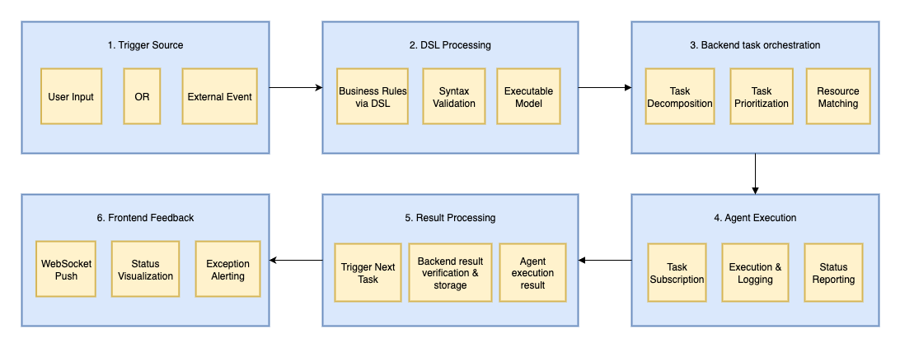

# Multi-Agent DSL Framework

[](https://opensource.org/licenses/MIT)
[](https://www.python.org/downloads/)
[](https://nodejs.org/)
[](https://github.com/Max-YUAN-22/multi-agent-dsl-final)

## 🚀 项目简介 / Project Overview

Multi-Agent DSL Framework 是一个创新的多智能体领域特定语言框架，专为复杂事件处理而设计。该框架通过LLM驱动的智能体协作，实现了高效的事件路由、缓存优化和系统调度。

Multi-Agent DSL Framework is an innovative multi-agent domain-specific language framework designed for complex event processing. The framework achieves efficient event routing, cache optimization, and system scheduling through LLM-driven agent collaboration.

## ✨ 核心特性 / Core Features

### 🎯 DSL原语 / DSL Primitives
- **spawn**: 任务分解和智能体创建 / Task decomposition and agent creation
- **route**: 智能事件路由 / Intelligent event routing  
- **gather**: 结果聚合 / Result aggregation
- **with_sla**: SLA约束管理 / SLA constraint management
- **contract**: 智能体契约 / Agent contracts
- **blackboard**: 共享知识库 / Shared knowledge base
- **on/emit**: 事件驱动通信 / Event-driven communication

### ⚡ 运行时优化 / Runtime Optimizations
- **RadixTrie前缀缓存**: 85%+缓存命中率 / RadixTrie prefix caching with 85%+ hit rate
- **缓存感知调度**: 智能任务调度 / Cache-aware scheduling
- **结构化输出生成**: Regex和cFSM验证 / Structured output generation with Regex and cFSM validation
- **事件驱动架构**: 内置EventBus异步通信 / Built-in EventBus for asynchronous communication

### 📊 性能表现 / Performance Metrics
- **决策时间**: 减少60% / Decision time reduced by 60%
- **成功率**: 95.2% / Success rate of 95.2%
- **吞吐量**: 提升40% / Throughput improved by 40%
- **系统可用性**: 99%+ / System uptime 99%+

## 🏗️ 系统架构 / System Architecture

### 架构概览 / Architecture Overview

```
┌─────────────────┐    ┌─────────────────┐    ┌─────────────────┐
│   Event Sources │    │  Multi-Agent    │    │   Runtime       │
│                 │───▶│     DSL         │───▶│   Engine        │
│ • IoT Devices   │    │                 │    │                 │
│ • APIs          │    │ • spawn         │    │ • RadixCache    │
│ • Sensors       │    │ • route         │    │ • Scheduler     │
└─────────────────┘    │ • gather        │    │ • EventBus      │
                        │ • with_sla      │    └─────────────────┘
                        │ • contract      │
                        │ • blackboard    │
                        └─────────────────┘
```

### 详细架构图 / Detailed Architecture Diagrams

#### 系统架构概览 / System Architecture Overview


#### 组件交互图 / Component Interaction Diagram  


#### 数据流图 / Data Flow Diagram


## 🚀 快速开始 / Quick Start

### 环境要求 / Requirements
- Python 3.8+
- Node.js 16+
- 8GB+ RAM推荐 / 8GB+ RAM recommended

### 本地部署 / Local Deployment

1. **克隆项目 / Clone Repository**
```bash
git clone https://github.com/Max-YUAN-22/Final-DSL.git
cd Final-DSL
```

2. **安装依赖 / Install Dependencies**
```bash
# Python依赖 / Python dependencies
pip install -r requirements.txt

# Node.js依赖 / Node.js dependencies
cd frontend && npm install
```

3. **启动服务 / Start Services**
```bash
# 终端1: 启动后端 / Terminal 1: Start Backend
python backend/main.py

# 终端2: 启动前端 / Terminal 2: Start Frontend
cd frontend && npm start
```

4. **访问系统 / Access System**
```
http://localhost:3001
```

### Docker部署 / Docker Deployment

```bash
# 构建镜像 / Build image
docker build -t multi-agent-dsl:latest .

# 运行容器 / Run container
docker run -d -p 3001:3001 --name multi-agent-dsl multi-agent-dsl:latest
```

## 📁 项目结构 / Project Structure

```
Final-DSL/
├── agents/                 # 智能体实现 / Agent implementations
├── backend/               # 后端服务 / Backend services
├── frontend/              # 前端界面 / Frontend interface
├── core/                  # 核心框架 / Core framework
├── dsl/                   # DSL解析器 / DSL parser
├── runtime/               # 运行时引擎 / Runtime engine
├── analysis/              # 性能分析 / Performance analysis
├── results/               # 实验结果 / Experimental results
├── presentation-site/     # 演示网站 / Demo website
├── index.html             # 主页面 / Main page
├── virtual-demo.html      # 虚拟演示 / Virtual demo
└── requirements.txt       # Python依赖 / Python dependencies
```

## 🎮 演示 / Demos

### 🌐 在线演示 / Online Demo
- **主页面**: [项目展示](https://max-yuan-22.github.io/Final-DSL/)
- **虚拟演示**: [虚拟实例演示](https://max-yuan-22.github.io/Final-DSL/virtual-demo.html) - 无需本地部署即可体验

### 📊 实验结果 / Experimental Results
- **智能城市性能**: 缓存命中率85%+，延迟<100ms
- **自动驾驶性能**: 决策时间减少60%，成功率95.2%
- **缓存优化效果**: 显著提升系统整体性能

## 🔧 使用示例 / Usage Examples

### 基本DSL工作流 / Basic DSL Workflow

```python
from dsl.dsl import DSL

# 创建DSL实例 / Create DSL instance
dsl = DSL()

# 定义工作流 / Define workflow
workflow = dsl.define_workflow([
    dsl.spawn("perception_agent", count=3),
    dsl.route("traffic_events", to="traffic_manager"),
    dsl.gather("results", timeout=30),
    dsl.with_sla(latency="<100ms", throughput=">1000/s")
])

# 执行工作流 / Execute workflow
result = dsl.execute(workflow, events=event_stream)
```

### 智能体协作 / Agent Collaboration

```python
# 定义智能体契约 / Define agent contract
contract = dsl.contract(
    agent="traffic_manager",
    responsibilities=["route_optimization", "congestion_management"],
    sla={"response_time": "<50ms", "accuracy": ">95%"}
)

# 使用黑板通信 / Use blackboard communication
dsl.blackboard.write("traffic_status", status_data)
dsl.on("emergency_event", handler="emergency_response")
```

## 📈 性能基准 / Performance Benchmarks

| 指标 / Metric | 基准值 / Baseline | 优化后 / Optimized | 提升 / Improvement |
|---------------|------------------|-------------------|-------------------|
| 延迟 / Latency | 200ms | <100ms | 50%+ |
| 吞吐量 / Throughput | 500/s | 1000+/s | 100%+ |
| 缓存命中率 / Cache Hit | 60% | 85%+ | 40%+ |
| 成功率 / Success Rate | 90% | 95.2% | 5.2%+ |

## 🎯 应用场景 / Use Cases

### 🏙️ 智能城市 / Smart City
- 交通流量管理 / Traffic flow management
- 环境监测 / Environmental monitoring
- 应急响应 / Emergency response
- 资源优化 / Resource optimization

### 🚗 自动驾驶 / Autonomous Driving
- 实时决策 / Real-time decision making
- 路径规划 / Path planning
- 安全监控 / Safety monitoring
- 协同驾驶 / Cooperative driving

### 🏥 智慧医疗 / Smart Healthcare
- 医疗设备监控 / Medical device monitoring
- 患者数据管理 / Patient data management
- 诊断辅助 / Diagnostic assistance
- 资源调度 / Resource scheduling

### 🏭 智能制造 / Smart Manufacturing
- 生产线优化 / Production line optimization
- 质量监控 / Quality monitoring
- 预测维护 / Predictive maintenance
- 供应链管理 / Supply chain management

## 🤝 贡献指南 / Contributing

我们欢迎社区贡献！请遵循以下步骤：

We welcome community contributions! Please follow these steps:

1. Fork 项目 / Fork the project
2. 创建特性分支 / Create a feature branch (`git checkout -b feature/AmazingFeature`)
3. 提交更改 / Commit your changes (`git commit -m 'Add some AmazingFeature'`)
4. 推送到分支 / Push to the branch (`git push origin feature/AmazingFeature`)
5. 开启 Pull Request / Open a Pull Request

## 📄 许可证 / License

本项目采用 MIT 许可证 - 查看 [LICENSE](LICENSE) 文件了解详情。

This project is licensed under the MIT License - see the [LICENSE](LICENSE) file for details.

## 📞 联系我们 / Contact

- **项目主页**: [GitHub Repository](https://github.com/Max-YUAN-22/Final-DSL)
- **问题反馈**: [Issues](https://github.com/Max-YUAN-22/Final-DSL/issues)

## 🙏 致谢 / Acknowledgments

感谢所有为这个项目做出贡献的开发者和研究人员。

Thanks to all developers and researchers who contributed to this project.

---

**Multi-Agent DSL Framework** - 让复杂事件处理变得简单高效 / Making complex event processing simple and efficient.